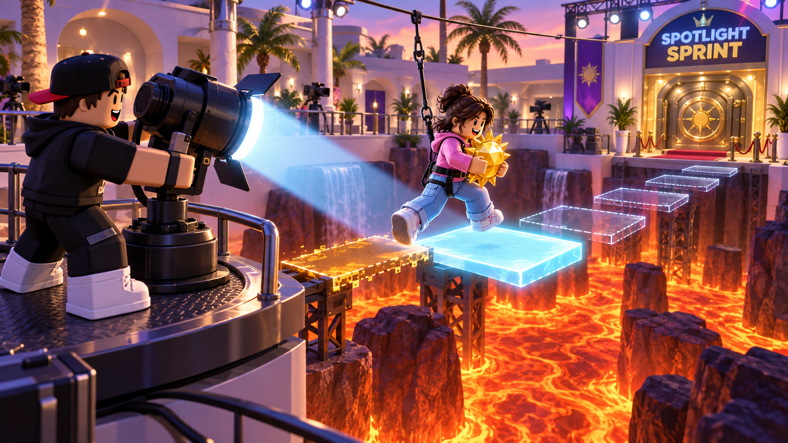

# Spotlight Sprint

10 September 2026 · Candidate; ordinary counterplay and role exposure need testing

**Associated creature:** [Wicklet](../creatures/wicklet.md). **Design context:** [The Midnight Fair v3](../midnight-fair-design-v3.md). [Shared challenge rules](shared-rules.md) define the common participation, Rig, Catch, clue, and reward requirements. This file owns this challenge's specific controls, physical effect, recovery location, and unresolved tests.

## Creature and purpose

**Wicklet**, a baby moth, travels to its roost in a lantern while a partner makes moonlit stepping plates solid.

Character anatomy, color proposals, and nursery behavior live in the creature record. The round's winning team earns one baby per eligible player; station deliveries and individual saves do not award extra babies. See the [central reward rule](../midnight-fair-design-v3.md#8-collection-rewards-and-rarity).

## Mechanical proposal and adaptation status

The mechanical proposal below is retained from the earlier pair-challenge study, with current role vocabulary. Its reference staging and illustrations may still use a treasure, egg, hatchling, or clockwork prop. The associated v3 creature above is a proposed adaptation, not a completed replacement of those assets or a validated change to physics. Keeping both descriptions explicit preserves the unresolved design work.

## Reference staging

A contestant carries a huge sun jewel across a broken catwalk above theatrical lava. Their partner operates a studio spotlight. Unlit stepping plates are transparent; lighting one makes it solid. A short, visible afterglow keeps a plate solid after the beam moves away.

## Normal play

The light operator drags the beam over the next plate. The runner moves across the lit plates; a short assisted hop handles each marked gap, avoiding a second precision-jump control in the first study. The operator must move the beam ahead while the runner leaves the fading plate, and a stationary beam cannot finish the route. At a safe halfway plinth the jewel is secured and the contestants exchange jobs for the return route to the vault. Both see a plate's remaining afterglow as a shrinking outline.

## The trust moment

"Start lighting the next one. I'm stepping off this one now." Success requires anticipation rather than waiting for both people to press together.

## Sabotage and prevention

Rig briefly shortens the afterglow of newly lit plates; their visible outlines still show their actual remaining life. A Trickster operating the light can sweep onward too early. A Trickster running can linger on a fading plate after the partner moves ahead. The ordinary error is the same sweep or hesitation at normal afterglow, which the partner counters by relighting the occupied plate or stepping back to a stable one, depending on their job; the shortened afterglow is what makes the counter arrive too late. If the jewel falls, Catch applies, and the runner's harness prevents an injury. A save returns both contestants and the jewel to their most recent safe plinth, retaining the jobs they held there.

## Evidence

"Nia moved the beam to plate 4 while Omar was still on plate 3." That records a potentially useful observation without deciding whether Omar hesitated or Nia moved too soon.

## First test

Can two unfamiliar players cross a short route without talking, and do both feel responsible for its timing? Stop expanding the idea if a light operator can play the whole route mechanically while the runner merely follows. Test each job's ability to prevent a fault independently. The harness fall is a tone decision for the 9–15 audience; [Bridge Keeper](bridge-keeper.md) is the same relationship with the avatars kept off the danger.

## Shared requirements and source

Use the [shared rules](shared-rules.md) for the team attempt, arming lifetime, spotter, Catch eligibility, and clue selection. Any job-specific gap described above remains a blocker; the creature adaptation does not resolve it. During Catch, use the reset location stated in this page. Rewards always follow the round's team result.

The complete earlier analysis and research interpretation are preserved in the [family exploration](../explorations/pair-challenge-families.md#spotlight-sprint). Reference activity identifiers and community observations come from the [dated research catalogue](../../../research/cooperative-subgames-catalog.md). This reorganization performs no new market or platform research.
