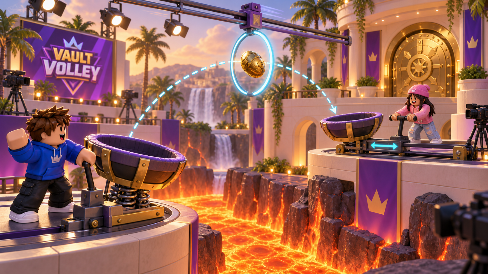
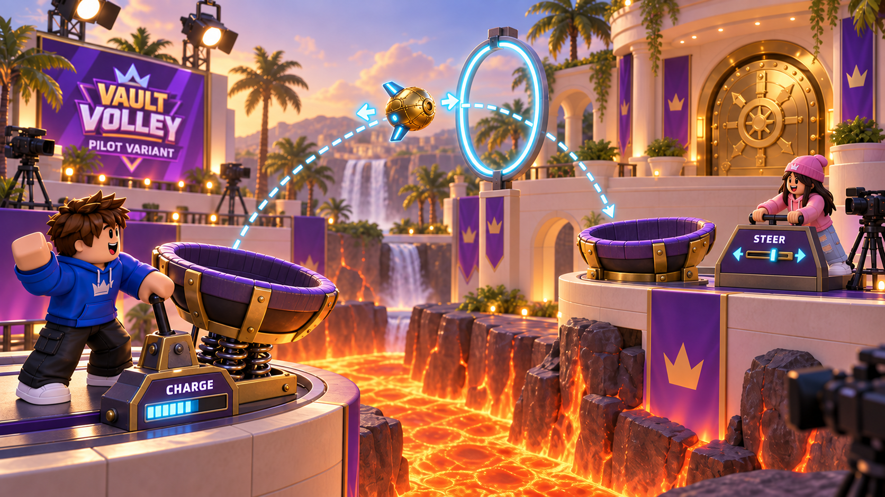

# Vault Volley

10 September 2026 · Candidate blocked on the receiver/pilot forcing an unpreventable loss

**Associated creature:** [Sailpip](../creatures/sailpip.md). **Design context:** [The Midnight Fair v3](../midnight-fair-design-v3.md). [Shared challenge rules](shared-rules.md) define the common participation, Rig, Catch, clue, and reward requirements. This file owns this challenge's specific controls, physical effect, recovery location, and unresolved tests.

## Creature and purpose

**Sailpip**, a baby glider, practices nest-to-nest flight using gentle launches and receiving cradles.

Character anatomy, color proposals, and nursery behavior live in the creature record. The round's winning team earns one baby per eligible player; station deliveries and individual saves do not award extra babies. See the [central reward rule](../midnight-fair-design-v3.md#8-collection-rewards-and-rarity).

## Mechanical proposal and adaptation status

The mechanical proposal below is retained from the earlier pair-challenge study, with current role vocabulary. Its reference staging and illustrations may still use a treasure, egg, hatchling, or clockwork prop. The associated v3 creature above is a proposed adaptation, not a completed replacement of those assets or a validated change to physics. Keeping both descriptions explicit preserves the unresolved design work.

## Reference staging

Two contestants stand at opposing launch-and-catch machines over a lava trench. They pass an oversized golden mechanical egg, the hatchling's egg in the living-mascot presentation, from machine to machine through moving hoops until it reaches the vault. Each successful handoff turns the receiving basket into the next launcher, so the jobs swap every time. Four handoffs give each player two sends and two receives; three is the shorter option if four do not fit, at the cost of one extra send for one player. The intermediate egg stays onstage, and only the last handoff banks a delivery.

## Normal play

The sender has one control: hold to charge, release to launch. A public power meter climbs while held and marks the band that reaches the next basket, and the launcher refuses to fire below the lowest band, so every launch is within the receiver's reach. Aiming an arc is a variant to test if one control proves too shallow. The receiver has **Reach**: hold to extend the basket over the trench, release and it springs back. Everyone sees the projected arc, the landing marker, the basket position, and whether the basket is open; no spoken countdown is needed. Flight lasts about two seconds, and moving hoops plus the basket's finite travel make timing matter.

## The trust moment

"I'm moving into place. Wait until I'm there." The sender has to commit; the receiver has to follow through.

## Sabotage and prevention

The ordinary error is a launch released before the basket is aligned or a basket that reaches late, which the receiver counters by tracking the actual flight rather than the meter. Use doubled launch charging for up to five seconds as the first Rig candidate; the meter and projected arc always show the actual launch. Keep the alternative fan-and-gust effect deferred so that the first comparison can isolate player timing. Receives have no Rig control. A Trickster receiver can move away after showing alignment, and the sender currently has no ordinary counter. Job swapping does not solve this: cargo armed during an earlier send stays armed through ordinary handoffs, so that later deliberate miss could become a diversion without a new physical burst. This is an unresolved violation of the shared ladder, not an accepted shortcut. A missed basket triggers Catch; a save returns the egg to the sender's machine for that failed handoff, without progress or a job change.

## Evidence

The second card is the worst handoff: "Leo launched before Maya's basket reached the landing marker" or "Maya's basket moved away after launch". Neither card says why. An operator-and-pilot variant would need its own factual handling vocabulary.

## Starting values (untested)

Four handoffs; two-second flight; three-second maximum ordinary charge; Rig doubles charging for up to five seconds after a 1.5-second hold. Arming belongs to the cargo under the shared rules, not to an individual launch. These values remain subject to resolving the receiver's counterplay problem.

## Reference-informed comparison

Storyboard an operator-and-pilot variant alongside the basket version. The sender chooses launch charge and release time; the partner steers the egg's small fins in flight toward a fixed receiving cradle using one horizontal control. Landing swaps jobs as before. The reference is SF-065, where the launched player retains movement control. Test whether steering feels expressive and worth repeating, rather than merely correcting someone else's bad launch. This variant still needs a sender's counter to deliberate bad steering; pilot agency alone does not fix the sabotage ladder.

## First test

Establish a normal counter for both jobs before advancing this family to a playable expansion. Then find whether there is room between effortless tracking and an impossible last-second throw. If every diversion reduces to the identical Catch test regardless of the preceding volley, the main interaction is not contributing enough counterplay. Start with fixed hoops, no random gusts, and no per-handoff countdown; the Gameshow reactions justify testing pressure separately. Check the landing marker on a phone and compare voluntary repeat play for the basket and pilot versions.

## Shared requirements and source

Use the [shared rules](shared-rules.md) for the team attempt, arming lifetime, spotter, Catch eligibility, and clue selection. Any job-specific gap described above remains a blocker; the creature adaptation does not resolve it. During Catch, use the reset location stated in this page. Rewards always follow the round's team result.

The complete earlier analysis and research interpretation are preserved in the [family exploration](../explorations/pair-challenge-families.md#vault-volley). Reference activity identifiers and community observations come from the [dated research catalogue](../../../research/cooperative-subgames-catalog.md). This reorganization performs no new market or platform research.
