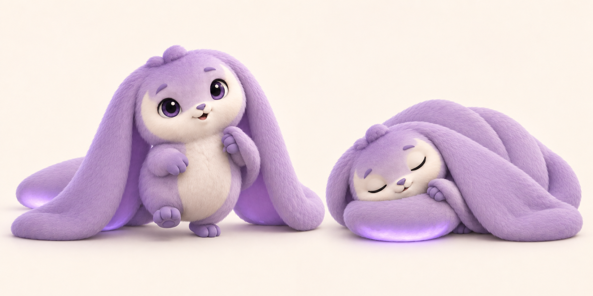

# Moonmop

10 September 2026 · Selected creature; character details follow user direction

**Associated challenge:** [Moonmop Lift](../challenges/moonmop-lift.md). **Game:** [The Midnight Fair](../midnight-fair-design-v3.md). This record owns the creature's identity and presentation; challenge controls and physical rules live in the linked challenge document.

## Identity and challenge story

**Moonmop** needs a protected lift to her overhead moon nest; her enormous trailing ears make the pod useful.

Moonmop has a round lilac body, a cream crescent facial marking, enormous broad ears that drag along the ground, and a softly glowing paddle tail. She sleeps with her head on her tail as a pillow and her ears over her body as a blanket. These features follow the user's selected [long-ear character study](../images/creatures/moonmop-design-pass-v3-2026-09-10.md).

This is a character reference, not a finished game asset or gameplay screenshot. The earlier [Moonmop Lift artwork](<../archive/artwork/moonmop-lift-villa-2026-09-10.png>) establishes protected cargo, two operators, and theatrical lava; its villa and Snake Show branding are historical staging.

## Nursery behavior

Gathers an ear around a hand; sleeps on her tail beneath her ears.

All colors use the same quality of interaction. The shared nursery and companion behavior is defined in the [main brief](../midnight-fair-design-v3.md#10-my-nursery-and-showing-off); species-specific behavior belongs here. No care timer, compulsory growth, or gameplay advantage is introduced by this record.

## Colors and rarity

The signature lilac color should remain common and appealing. Peach, mint, midnight blue, and pearl with a lilac glow are proposals; their final names, rarity tiers, and probabilities are unset. The dusk-exclusive reward idea remains unselected.

Color generation and reward eligibility follow the [central collection rules](../midnight-fair-design-v3.md#8-collection-rewards-and-rarity). An individual baby remains distinct from its species–color variant. Each eligible round winner receives one individual; petting, repeated saves, and station deliveries do not create additional awards.

## Development status and references

- [Selected long-ear study](../images/creatures/moonmop-design-pass-v3-2026-09-10.md): current character direction.
- [Earlier refinement](../images/creatures/moonmop-design-pass-v2-2026-09-10.md) and [initial proposals](../images/creatures/generation-notes-2026-09-10.md): historical exploration.
- The [connected browser study](../browser/README.md) now draws an original vector interpretation of Moonmop with protected pods, a local nursery, pet/rest responses and the five provisional colors. This implementation does not make its palette names, rarity odds or simplified art production selections.
- Production character modeling, animation and authoritative collection ownership are not established by a reference image or the local browser study.
