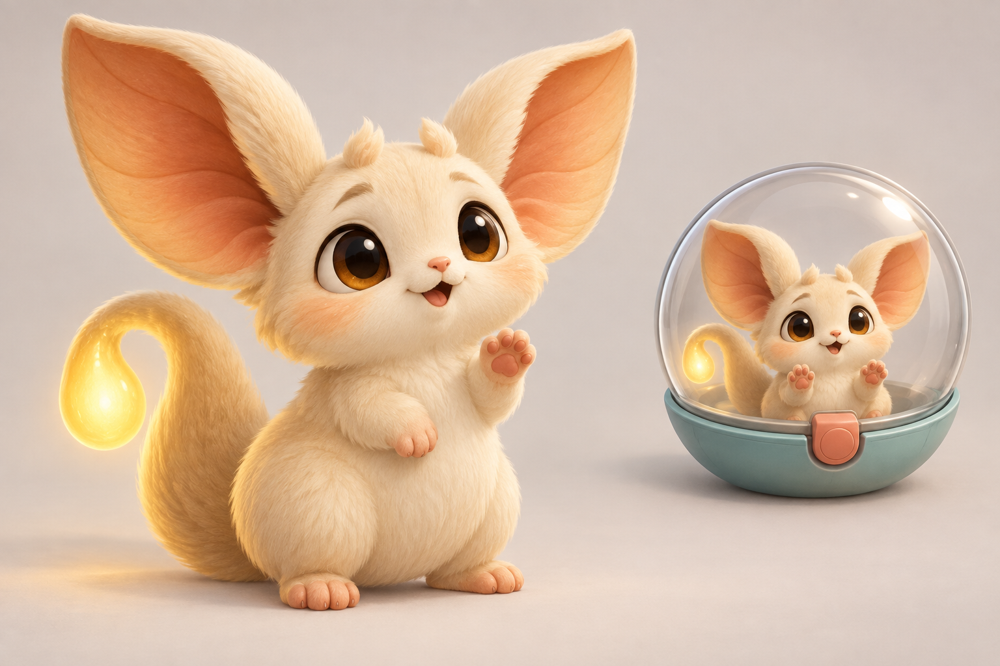
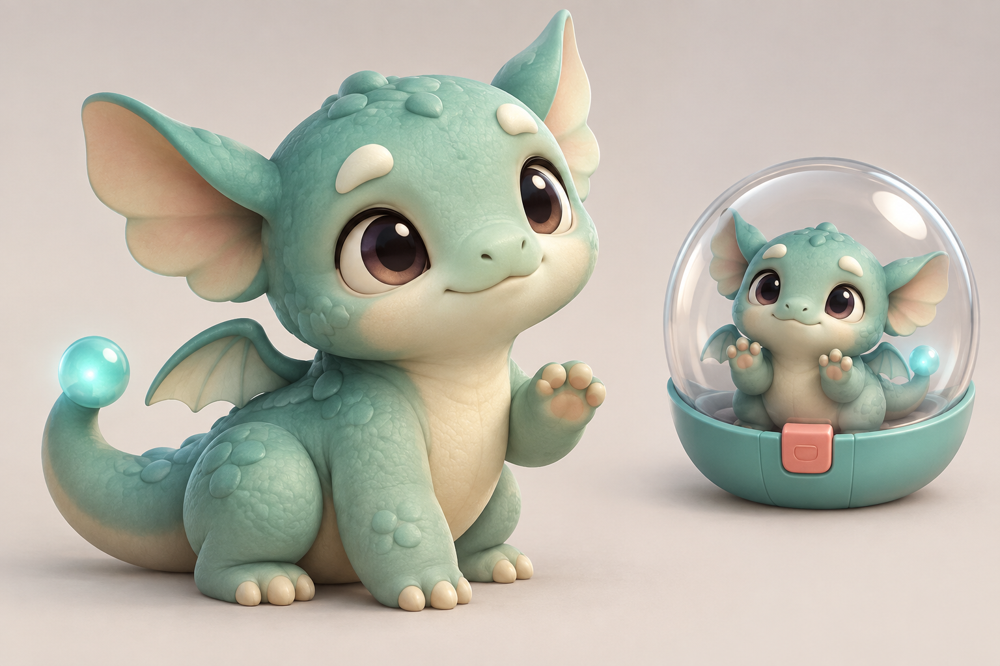
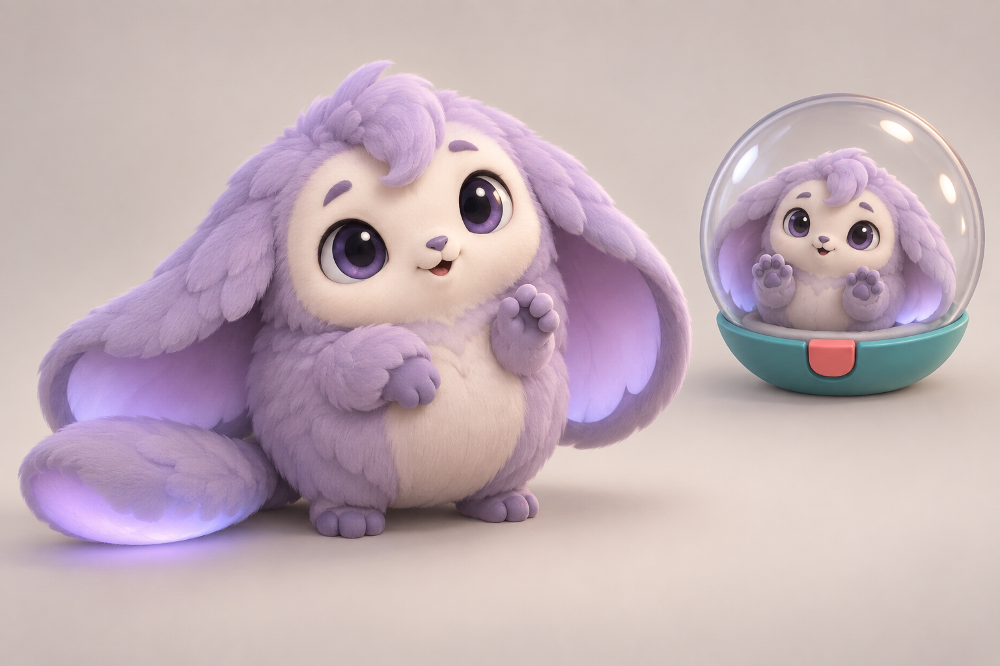

# Baby creature proposals

Generated 10 September 2026 with the built-in image generation tool. The user selected **Moonmop** as the living-prize character on the same date. Glowtail and Pebblewing remain unselected alternatives. This selects the visual direction; it does not change the challenge mechanics. Names are working labels.

The selected character appears in the updated Prize Lift key art. **Moonmop Lift** is the proposed challenge name shown in that artwork, pending a naming decision. See the [key-art edit notes and prompts](moonmop-lift-edit-2026-09-10.md).

A [second design pass](moonmop-design-pass-v2-2026-09-10.md) develops the purple creature's silhouette, facial marking, and body language following the originality review. It is a refinement proposal; the first-pass image below is preserved. The character and challenge names remain provisional.

The [third visual pass](moonmop-design-pass-v3-2026-09-10.md) follows the user's correction: restore enormous ears that drag on the ground; when she sleeps, her tail is her pillow and her ears are her blanket. This is the latest direction for ear proportions and sleeping behavior.

Each image includes a large character view and a smaller view of the same creature in a transport pod. All three outputs were visually reviewed for distinct silhouettes, readable expressions, and consistency between the character and pod views.

## Glowtail



### Final generation prompt

```text
Use case: stylized-concept.
Asset type: original baby-creature mascot proposal for Snake Show, a colorful cooperative social-deduction party game.
Create ONE polished landscape character proposal image. A large full-body three-quarter hero view of the baby creature occupies approximately the left two-thirds. On the right, one smaller vignette shows the SAME creature safely sitting in a simple clear spherical transport pod with a rounded teal base and a small coral latch, its little front paws pressed affectionately against the glass. The pod is a readable secondary contextual study, not a second creature species. Keep identity, anatomy, and colors consistent between views.
Style: appealing stylized 3D game-character concept render, simple rounded volumes suitable for an eventual mobile game model, tactile but restrained materials, readable silhouette and face at small size. Large expressive eyes with restrained highlights, visible brows, small nose and mouth, infant proportions and tiny paws. Warm soft studio light and clean pale warm-gray seamless backdrop with subtle contact shadows. Emotion: trusting, curious, vulnerable in an endearing way; a creature players want to protect. Hero view raises one small front paw in a shy greeting. Full body and tail visible, plenty of breathing room. No text, no logos, no watermarks, no humans, no additional props, no existing franchise characters, no injury or danger scene.
Subject: GLOWTAIL, an original palm-sized fantasy mammal. Pear-shaped buttercream body with short plush fur, enormous broad leaf-shaped upright ears with warm apricot interiors and softly rounded tips, tiny peach-colored front paws, short sturdy back feet. A thick curling tail wraps beside the body and ends in a softly luminous golden droplet, a distinctive simple shape. Honey-brown eyes and two short raised tufts above them. The ears are broad and organic rather than rabbit ears; muzzle is short, face is open and soft rather than pointed or foxlike. Understated apricot cheek coloring. No wings, no horns, no clothing. Make the big ear silhouette and golden glowing tail instantly recognizable.
```

## Pebblewing



### Final generation prompt

```text
Use case: stylized-concept.
Asset type: original baby-creature mascot proposal for Snake Show, a colorful cooperative social-deduction party game.
Create ONE polished landscape character proposal image. A large full-body three-quarter hero view of the baby creature occupies approximately the left two-thirds. On the right, one smaller vignette shows the SAME creature safely sitting in a simple clear spherical transport pod with a rounded teal base and a small coral latch, its little front paws pressed affectionately against the glass. The pod is a readable secondary contextual study, not a second creature species. Keep identity, anatomy, and colors consistent between views.
Style: appealing stylized 3D game-character concept render, simple rounded volumes suitable for an eventual mobile game model, tactile but restrained materials, readable silhouette and face at small size. Large expressive eyes with restrained highlights, visible brows, small nose and mouth, infant proportions and tiny paws. Warm soft studio light and clean pale warm-gray seamless backdrop with subtle contact shadows. Emotion: trusting, curious, vulnerable in an endearing way; a creature players want to protect. Hero view raises one small front paw in a shy greeting. Full body and tail visible, plenty of breathing room. No text, no logos, no watermarks, no humans, no additional props, no existing franchise characters, no injury or danger scene.
Subject: PEBBLEWING, an original palm-sized baby fantasy dragon. Squat rounded mint-teal body shaped like a smooth pebble, small warm ivory belly, short chunky legs and tiny hands, oversized rounded head with a broad soft muzzle. Two large rounded ear fins project sideways and angle gently upward; a pair of very small folded scalloped wings attaches to the back. Short thick tail curls beside the body, ending in a single soft luminous turquoise bead. Deep plum-brown eyes and two little ivory brow bumps, no sharp horns. Skin is smooth with only a few broad pebble-like scales. It should feel like a helpless hatchling with appealing physical weight, not a fierce dragon. No fur, no clothing, no sharp teeth, no spikes. Clearly readable ear-fin and miniature-wing silhouette.
```

## Moonmop



### Final generation prompt

```text
Use case: stylized-concept.
Asset type: original baby-creature mascot proposal for Snake Show, a colorful cooperative social-deduction party game.
Create ONE polished landscape character proposal image. A large full-body three-quarter hero view of the baby creature occupies approximately the left two-thirds. On the right, one smaller vignette shows the SAME creature safely sitting in a simple clear spherical transport pod with a rounded teal base and a small coral latch, its little front paws pressed affectionately against the glass. The pod is a readable secondary contextual study, not a second creature species. Keep identity, anatomy, and colors consistent between views.
Style: appealing stylized 3D game-character concept render, simple rounded volumes suitable for an eventual mobile game model, tactile but restrained materials, readable silhouette and face at small size. Large expressive eyes with restrained highlights, visible brows, small nose and mouth, infant proportions and tiny paws. Warm soft studio light and clean pale warm-gray seamless backdrop with subtle contact shadows. Emotion: trusting, curious, vulnerable in an endearing way; a creature players want to protect. Hero view raises one small front paw in a shy greeting. Full body and tail visible, plenty of breathing room. No text, no logos, no watermarks, no humans, no additional props, no existing franchise characters, no injury or danger scene.
Subject: MOONMOP, an original palm-sized nocturnal fantasy creature. A nearly spherical lilac plush body, enormous wide floppy ears that hang outward like a soft cape but remain distinctly TWO ears, very short legs, tiny lavender hands and rounded feet. A soft pale-cream oval face sits within the lilac fluff, dark violet curious eyes and expressive little brows. One wide thick paddle-shaped tail rests on the floor beside it; the underside emits a gentle cool lavender glow. Use a handful of broad softly scalloped fur clumps, not thousands of realistic hairs. A single off-center tuft curls over its forehead. It should feel shy, huggable and a little clumsy, with a clearly distinct low wide silhouette. No wings, no horns, no clothing, no rabbitlike upright ears.
```
