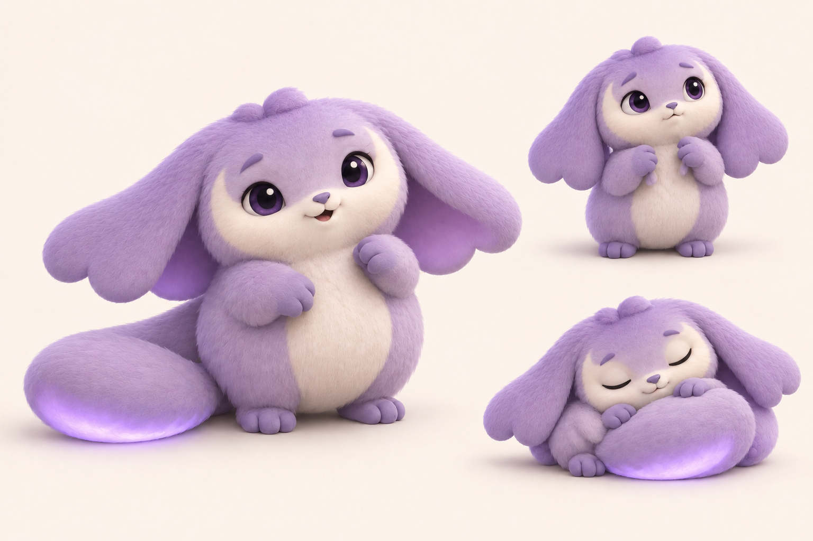

# Purple creature — second design pass

10 September 2026 · Built-in image generation tool · Refinement proposal

**Later correction:** The user restored the enormous original-style ears, extending them to drag on the ground, and specified the tail as a pillow and ears as a blanket. The [third visual pass](moonmop-design-pass-v3-2026-09-10.md) records that direction. The shorter scalloped ears and tail-as-blanket ideas below are historical proposals.

## Purpose and status

The user requested another design pass after reviewing the three proposals' originality. This pass develops the chosen purple creature's anatomy and body language. **Moonmop** remains a working label, and **Moonmop Lift** remains a proposed challenge name. This image is a refinement for review, not a naming decision or evidence of visual uniqueness. The first selected design and the existing challenge key art are preserved.

## Result



The final sheet develops three connected details:

- Broad ears with shallow, rounded scallops create a lower, wider silhouette.
- A cream crescent around the cheeks and a small low tuft give the face a simpler shape.
- The glowing paddle tail curls across the belly during sleep, suggesting a comforting blanket-like behavior.

The three poses explore curiosity, nervousness, and sleep. These are presentation ideas; they do not introduce movement, weight-shift, or secret-role mechanics. The nervous pose's exact paw-to-ear contact would need a clearer construction drawing before modeling or animation.

## References and visual review

- [Selected first-pass character](03-moonmop.png): identity reference for the initial revision.
- [Earlier proposals and selection record](generation-notes-2026-09-10.md).

The initial revision kept the large curled forelock and produced long finger-like ear divisions. A targeted refinement replaced those with a smaller tuft, shallow ear scallops, and a clearer crescent face marking. The final image was visually inspected for readable expressions, consistent purple/cream coloring, two ears, and the tail's behavior across the three poses. It is a concept sheet, not an orthographic model specification.

The final PNG is 1536 × 1024 pixels and was verified byte-for-byte against the generated output.

## Initial revision prompt

```text
Use case: stylized-concept.
Asset type: second-pass character development sheet for a chosen living-prize mascot in a colorful cooperative party game.
Input image: identity and continuity reference for the SELECTED purple baby creature, not a composition to reproduce exactly. Develop that creature further as specified below. The character's provisional name is Moonmop, but put NO text or names in the image.

Create ONE polished landscape concept sheet with THREE clearly separated full-body studies of the SAME revised creature on a clean warm off-white background. The large main three-quarter standing/sitting character view occupies the left 60%. The upper-right study shows its signature nervous pose, gathering its own floppy ear tips against its chest using its two tiny front paws. The lower-right study shows it curled up asleep, its ONE tail wrapping across its belly like a blanket. Maintain exact anatomy, materials, palette and markings across all three poses. Let each silhouette breathe with generous negative space. No panels, borders, typography, graphic symbols or external props. The three studies show one species, not three options.

Preserve the qualities the user chose: a very small, huggable lilac fantasy baby with a low wide plush body, cream face and belly, TWO oversized soft drooping ears, short feet, two tiny front paws, a wide glowing paddle tail, shy trusting personality. It should clearly feel descended from the reference, still cute and emotionally expressive.

Develop these specific anatomical signatures clearly and deliberately:
1. TWO broad low-set ear sheets sweep outward and downward, making a recognizable low wide silhouette. Each ear ends in exactly THREE broad, blunt, rounded lobes, like the hem of a soft mop or a three-lobed petal. The three separations occupy only the last quarter of each ear; the upper three quarters are one continuous wide ear. These are solid soft ear tips, NOT feathers, separate fingers, wings, strings, hair strands, or extra limbs. Give the inner surface a slightly darker violet tone. The lobes must be large enough to read at thumbnail size and visible in the main view.
2. ONE long broad fleshy plush paddle tail attaches low at the back. It is wide and flexible enough to curl loosely across the lower belly like a heavy blanket, but remains visibly connected to the body. Its outer surface is lilac; a soft continuous lavender glow runs along the underside edge. Show its attachment and breadth beside the body in the main three-quarter view, then its functional blanket-like curl in the sleeping study. No separate blankets, no extra tails, no fabric seams. This is an animal body part.
3. Give it a simpler, more individual face. Reduce the eyes slightly relative to the reference, with soft rounded teardrop outlines, warm dark-plum irises, one small highlight per eye, and expressive slightly uneven upper lids. Keep the eyes engaging and easy to read, not sleepy to the point of indifference. Replace the reference's generic large curled forelock with a small low off-center two-point tuft. Shape the cream face marking like a broad shallow crescent across the cheeks, with tips rising toward the temples, rather than a perfect oval disk. Tiny muted-violet bean nose and short gentle mouth, subtle brows. No human teeth, eyelashes or makeup.
4. Simplify fur into a short velvety felt-like surface and a few broad rounded clumps at the outline. Avoid detailed photoreal hair and ornamental excess. Favor coherent simple volumes that could eventually become a readable stylized mobile-game model.

Pose and emotion:
Main view: tiny sturdy feet visible, both floppy ears relaxed and fully visible with their three-lobed tips, one paw held tentatively near its chest and the other low, head tilted slightly, inquisitive trusting gaze toward the viewer. Show the complete silhouette, no crop. The large paddle tail rests curving beside the creature so its attachment is understandable.
Nervous study: both paws clutch the tips of the corresponding two ears in front of its chest, shoulders slightly hunched, eyes look up for reassurance. Clear and endearing body language, no distress or crying. Do not turn ear lobes into hands.
Sleeping study: body tucked low, eyes peacefully closed, ears drooping beside its cheeks, broad tail curling forward across the belly with a subtle soft glow visible along the underside. Keep face, paws and tail connection readable.

Style: polished stylized 3D character-development render, warm diffuse studio lighting, restrained ambient occlusion, gentle contact shadows, delicate lavender/cream palette. This is a purposeful anatomical and personality revision, not a recolor. No container or transport pod in this sheet, no humans, scenery, logos, named franchise references, accessories, extra limbs, injury, or watermarks.
```

## Final refinement prompt

This pass edited the initial generated revision.

```text
Use case: precise-object-edit.
Asset type: refined second-pass mascot anatomy and personality sheet.
Edit the attached three-pose purple baby-creature sheet. Keep the landscape layout, the large left view, small upper-right nervous view, small lower-right sleeping view, warm clean background, lilac/cream palette, short plush material and glowing broad tail. Keep the creature affectionate and appealing. Make the following coherent anatomical refinement CONSISTENTLY in all three views. This is a character-design revision, not just polish.

EAR SHAPE, highest priority:
The reference currently has long fingerlike divisions at the ear ends. Redesign each of the TWO ears as ONE continuous wide soft sheet, ending in a very shallow THREE-SCALLOP hem. Imagine a broad heavy petal with a three-bump wavy edge. There are exactly three LARGE, BLUNT ROUND BUMPS along the bottom of each ear, separated only by two SHORT shallow dips. The dips extend no more than one-sixth of the ear length. The lobes should NOT look like long fingers, separate appendages, feather strands or bunny paws. Round solid lobes share a broad fused root. Make the pair of ears somewhat shorter and broader overall than in the reference; the ear silhouette is low, wide, soft and clearly asymmetrical in pose. Exactly two ears and three shallow scallops per ear. Keep darker-violet inner ear surfaces. Each ear retains a single simple silhouette.

FACE AND HEAD, second priority:
Remove the large curled hair quiff COMPLETELY from ALL three views. Replace it with a very low small offset two-bump tuft resting almost flat against the crown. No spiral, no hanging curl. Flatten and broaden the head slightly, creating a compact low-wide silhouette integrated into the rounded body.
Change the perfect cream oval face mask into a CLEAR UPWARD-OPENING CRESCENT: cream across the muzzle and broad cheeks, tapering into two pointed-soft tips that rise beside the OUTER corners of the eyes toward the temples. The central forehead, bridge between the eyebrows, and inner upper eye areas remain lavender, dipping down into the crescent marking. Do NOT add a moon icon; the CREAM FUR MARKING ITSELF forms this recognizable shape.
Change the eyes from tall glossy round toy eyes to slightly smaller wide soft bean-shaped eyes, with subtle upper lids and one restrained highlight. Use dark plum iris coloring, keep attentive expressive eye contact, and make one eyebrow very slightly higher for an inquisitive look. Retain tiny muted-violet bean nose and gentle small mouth. Preserve warmth and vulnerability. No eyelashes or human teeth.

GESTURE:
In the upper-right nervous view, have each little paw visibly PINCH AND HOLD the short inner scallop of its corresponding ear near the chest, gently drawing the two ear hems inward. The hands are in contact with actual ear tips, not clenched together while ears hang untouched. No additional fingers or hands. Keep an upward looking, trusting expression.
Keep the lower-right sleeping pose with the ONE glowing paddle tail curved across its belly, eyes closed. Make its tail continue from the side of the body; no separate cushion or accessory.

Keep all three poses recognizable as the SAME revised animal with the same crescent face marking, shallow three-scallop ears, low small tuft, and single broad tail. Clear readable anatomy. Do not add containers, text, logos, accessories, other characters, illustrations of existing franchises, watermarks, or any additional studies. Return one complete landscape sheet.
```
