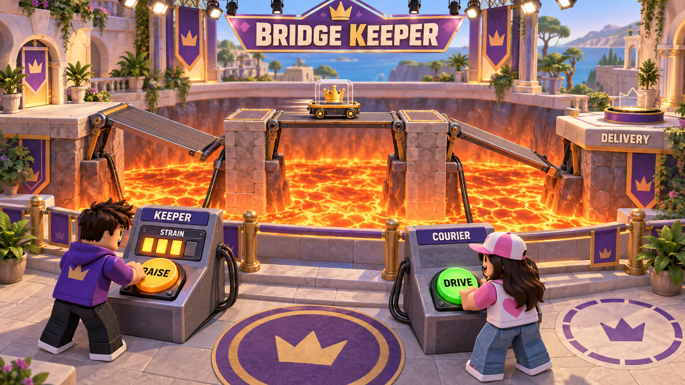
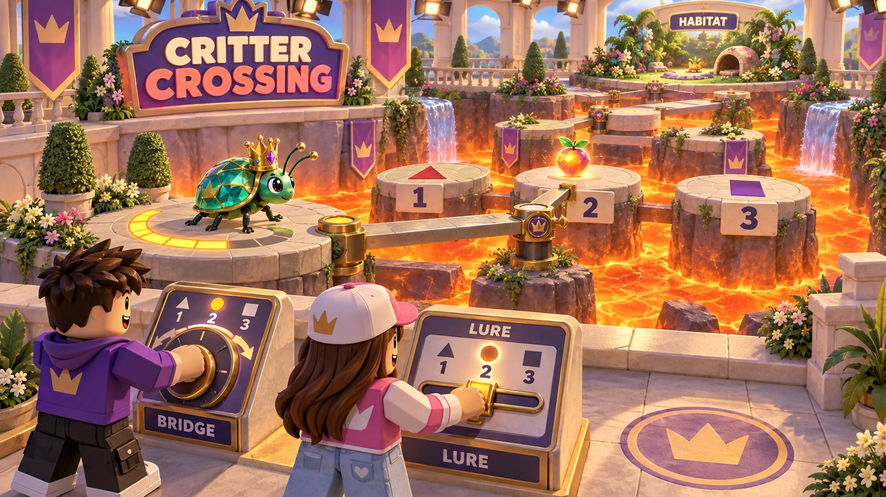
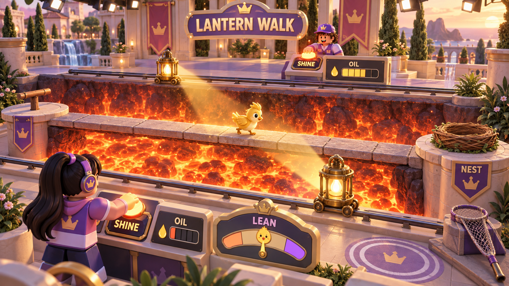
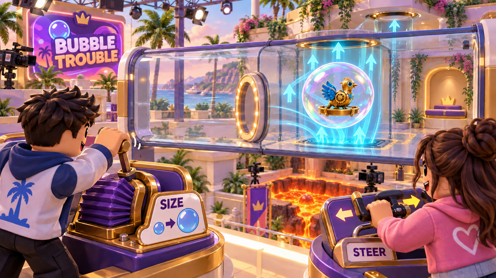
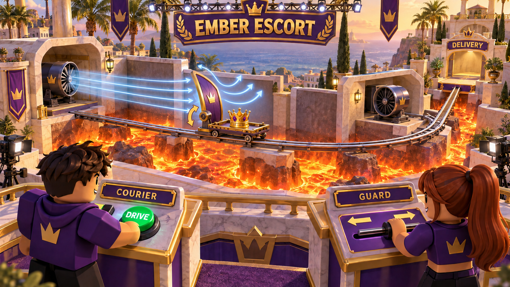
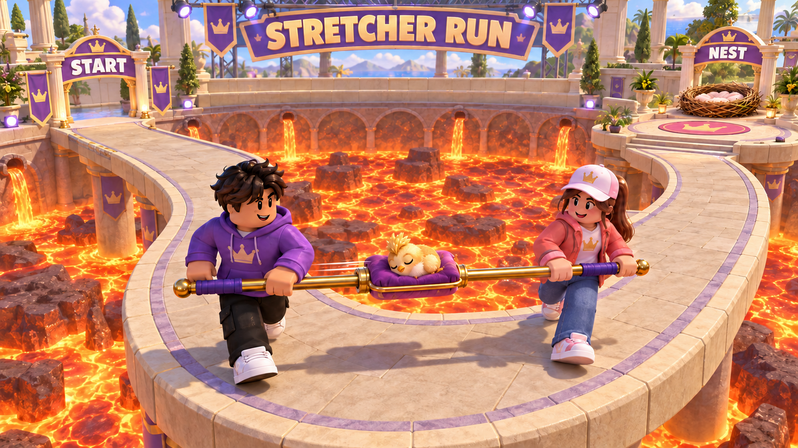
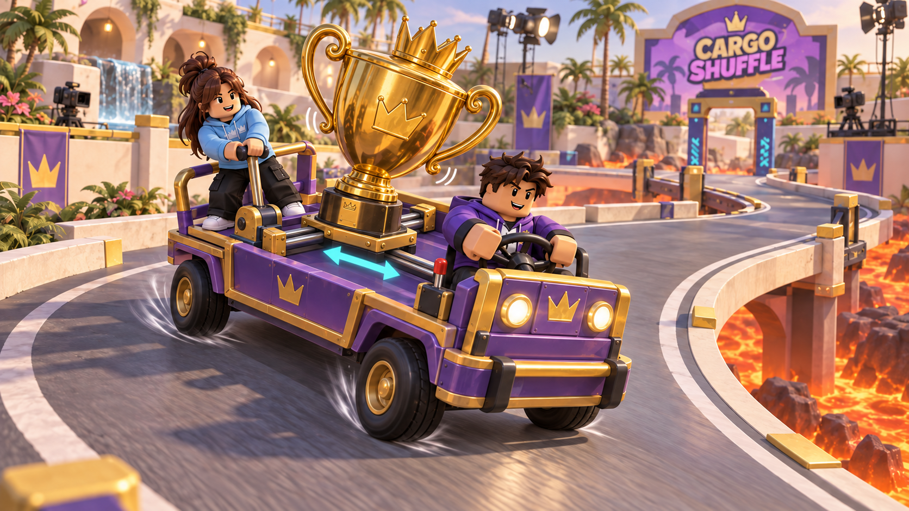

# Cooperative pair challenge families: exploration

9 September 2026 · Design exploration · No family in this document is adopted, scoped, or scheduled

Prize Lift establishes one kind of cooperation: two people continually adjust the same unstable object. Snake Show can explore other relationships between partners while keeping its central question: **did my partner struggle, or did they use my trust to steal the prize?** The [design brief](snake-show-design-brief-v2.md) plans two more mechanically distinct challenge families after Prize Lift is validated, and it requires each family to describe normal play, sabotage, prevention, evidence, and rewards before it enters the backlog. This document merges two explorations of candidates for that step. Both drew on the cooperative structure of Hazelight Studios' *It Takes Two* (2021) and *Split Fiction* (2025) and adapted it to a game where one partner may be secretly working against the other.

Everything here is a proposal. Prize Lift's rules in the brief are the reference. Its settings came from a playable model; the values below are untested starting points chosen to match Prize Lift's timings, and most candidates have no values yet. This exploration does not change the first playable's scope, the episode structure, or the brief's **spotter** rule for odd casts, whose alternatives are recorded in the [pairing and elimination review](pairing-and-elimination-review.md). Every candidate requires exactly two contestants per station, so the spotter rule applies to all of them as the shared rules below state.

The proposals follow the direction in [user-notes.txt](../../user-notes.txt): design for ages 9–15, use lava instead of water, and put something valuable or alive at stake. The brief still says 13–16 and uses a pool; those passages are not reconciled here. Audience is a design target, not an eligibility claim. Proposed sets use theatrical lava channels, valuable show props, and protected mascots. Failures end in a collection chute or a safety harness, no creature or contestant is ever shown hurt, and all stakes belong to the episode, never to a player's owned inventory.

## Terms used in this document

- **Station**: one instance of a challenge, with its own cargo, two jobs, and a marked rescue area. Every station in an act uses the same family, layout, and settings.
- **Job**: what one of the two contestants at a station does, with its own console or control. Prize Lift's two jobs are identical. Several candidates below have two different jobs, and some exchange them partway through.
- **Cargo**: the thing at risk in a challenge. Following the user's direction it is valuable or alive: the golden crown capsule from the browser adaptation, a show prop such as a sun jewel or a golden egg, or an original living mascot. A lost cargo drops into an opaque collection prop above the lava and reappears at the finale.
- **Checkpoint**: a safe point inside a challenge where progress is secured. Some candidates exchange jobs there, and a successful Catch returns the cargo to the checkpoint the candidate names.
- **Coupling**: how the two jobs' inputs combine to move the cargo. Prize Lift is a shared balance: the sum of the two motors lifts, and the difference tilts.
- **Trust moment**: the point where the right action for one partner depends on what the other partner is about to do.
- **Fault**: the moment the cargo leaves its safe support and the rescue sequence begins. **Loss**: an unrescued fault. A loss of rigged cargo is a heist; a loss of innocent cargo is not.
- **Sabotage ladder**: the four steps every family needs: an ordinary error, the partner's normal counter, a Rig effect that defeats that counter, and a last-resort rescue.

Act, heist, receipt, Prize Pot, Rig, Catch, rescue area, spotter, Loyal, and Snake keep their meanings from the brief.

## What to take from the references

The [reference catalog](../../research/cooperative-subgames-catalog.md) identifies 265 activities across *It Takes Two* and *Split Fiction*, separating interdependent cooperation, parallel tasks, competition, and scripted interactions. Different tools that require each other are one recurring pattern; identical jobs and playful exploration matter too. The catalog's [community research](../../research/cooperative-subgames-catalog.md#community-favorites-and-replay-appeal), checked on 9 September 2026, adds evidence about enjoyment and replay. Six design lessons are useful here.

1. **Two contributions, one goal.** Complementary tools make each player's contribution visible; identical tools can also demand close cooperation. In Snake Show, jobs can differ as long as every pair in the act faces the same two jobs and job assignment is independent of secret roles.
2. **Trust windows.** One player holds a platform, a switch, or a timer while the other moves through danger. Progress depends on the partner keeping their word. This is the natural home for betrayal: the Rig is what breaks the hold.
3. **Handoffs and rhythm.** Players alternate quickly: throw, catch, throw. Both stay busy and both keep watching. Alternation also gives both players sabotage turns and evidence turns.
4. **Familiar controls, changing situations.** Recurring movement controls support changing tools in the reference games. In Snake Show, Rig and Catch keep the same input and rescue rules across families; each family's physical Rig effect and cooperation control still need teaching.
5. **Readable partner actions.** Seeing a partner's contribution helps explain cooperation. Some reference puzzles deliberately withhold information or change perspective; Snake Show instead requires one shared public scene under a fixed camera that observers and later voters can read.
6. **Room for playful experimentation.** Optional activities let pairs explore an interaction beyond its required solution. Snake Show's proposed lobby training arena is a place to test that appeal without extending an act. Brief novelty alone is insufficient: a core family must remain enjoyable on repeat.

The design interpretation is to give each pair a short, understandable relationship: **I make your path; you choose when to cross. I send; you receive. I change our size; you find our route.** Each should support a satisfying success in practice with two Loyals. Sabotage then puts pressure on an already enjoyable interaction.

The adaptation needs restraint. Snake Show's provisional 45-second challenge phase includes grouping and instructions and must work without conversation. A long puzzle with private clues would place very different demands on that format. Start with one visible rule per job, a shared view of the important action, and a small variation during the attempt. Reserve the larger spectacle for presentation. Three more things do not transfer: the reference campaigns assume shared progress goals rather than hidden-role deduction, while every Snake Show family needs the sabotage ladder, an innocent look-alike for every fault, and receipt rules; console-length sessions and multi-button controllers do not fit one thumb control per job; and their tone and content were made for a different platform and audience, so borrow structure, not scenes.

### What the community evidence changes

The research draws on 20 community sources, mostly public English-language discussions. It provides qualitative leads, not a population ranking or evidence about Snake Show's 9–15 audience. The distinctions below are our design judgments. Catalog IDs locate the source mechanics; chapter-level praise does not establish that a particular mechanic caused that praise.

| Reference and evidence | Implication for this exploration |
| --- | --- |
| **Castle dungeon** has repeated praise and requests for whole games like it; **Cuckoo Clock** attracts praise for its abilities and setting (IT-060–063; IT-065–076). | Retain gate-and-runner and complementary-tool candidates. Test whether both jobs feel capable and useful. The brief excludes combat, so the dungeon is a reference for interdependent tools, not a reason to add fighting. |
| **Cooperative pinball** has requests for more and later mentions as a highlight (SF-065–066). | Give Vault Volley an operator-and-pilot comparison: one initiates movement while the other can still shape it. This is a promising relationship to test, not proof that throwing any cargo is popular. |
| **Collapsing Star** is repeatedly praised for spectacle and tension, with some stress-related dissent (SF-S06–06a). | Explore one protection-and-movement lead below. Test the protector's decisions and both jobs' counterplay before counting it as distinct from Bridge Keeper. |
| **Moon Market** and **Snow Globe** attract affection for exploration and spending time together (SF-S08–08d; IT-079–087). | Use the already proposed training arena to test whether pairs voluntarily keep playing with the controls. This evidence does not justify lengthening acts or making a large exploration area. |
| **Farmlife** and **Birthday Cake** attract shared laughter and surprise; Birthday Cake's tone also divides players (SF-S02–02a; SF-S12–12b). | Favor expressive, player-controlled reactions in Bubble Trouble and the existing mascots. A funny success or recoverable mistake should arise from an action; a one-time reveal cannot carry repeated rounds. |
| **Gameshow** has strongly mixed reactions; **Laser Tennis** has recurring competitive replay praise (SF-S05–05a; IT-M07). | Test handoff pressure with unfamiliar pairs before adding countdowns. Laser Tennis supplies evidence for versus replay, not for hidden-role cooperation, so it does not become a core family. |
| **Split Fiction's finale** is repeatedly praised for perspective changes and surprise (SF-085–093). | Keep it as a presentation reference. Camera tricks and private views would undermine the shared evidence scene. |

This raises the importance of satisfying honest play, active control in both jobs, and voluntary replay. It does not establish which Snake Show candidate will win a comparison. Keep Lantern Walk, Cargo Shuffle, and Rail Cart behind mechanically different candidates: a popular creature or vehicle theme does not make their underlying balance rule new.

## Rules every candidate must satisfy

These rules are shared so that the family descriptions do not repeat them. They extend the brief's Prize Lift rules to any two-job challenge.

- **Normal play comes first.** Aim for a clean run of about 12–20 seconds and about 25–30 seconds of active play including one fault and its recovery, leaving the rest of the provisional 45-second phase for entry, instruction, and exit. This is a test target, not evidence that every candidate fits. Name the satisfying action for each job and test voluntary replay with two Loyals before adding sabotage pressure. A contestant who does nothing prevents a delivery; that never awards a theft.
- **Two jobs, one cargo, one delivery.** A completed challenge banks one delivery per station per act into the Prize Pot. Partial progress earns no delivery. Repeated faults, multiple handoffs, or job exchanges never grant extra Snake attempts or heists. The proposals add no currencies, paid advantages, or persistent prize ownership.
- **Job assignment and exposure.** Jobs are assigned independently of secret roles, and one layout and rule set applies to every station in the act. Several candidates exchange jobs at a checkpoint; a failed pair may never reach it, so an exchange cannot by itself establish equal exposure. Where jobs differ, the game also alternates a contestant's job across acts whenever the schedule allows, and receipts compare like jobs with like jobs. Compare difficulty, arming access, blame, and time in each job, and test each station with two Loyals, one Snake in either job, and two Snakes sharing the single team attempt.
- **Rig.** Rig is the private button that can sabotage. Hold it for 1.5 seconds instead of the ordinary control while participating in the current job; during the hold it also sends the ordinary input, so the public action is ordinary. Releasing early releases the reservation. Completing the hold consumes the Snake team's one attempt for the act and arms the concealed diverter for that cargo until a Catch, delivery, loss, timeout, or cancellation resolves it; changing jobs or reaching a checkpoint does not clear it. Completion also starts a temporary physical effect of up to five seconds that the family defines, in one of two patterns: a doubling of the Snake's own control, as in Prize Lift, or a station-wide change that either job can exploit. The effect is visible to anyone watching, as the doubled motor is in Prize Lift, and no receipt records it. The Snake must still exploit the situation; a visible mistake can also happen without Rig. A Snake spotter's Rig from the rescue area arms the cargo with no physical change, exactly as in the brief.
- **The sabotage ladder.** Each candidate must show all four steps. With ordinary inputs, no single job should be able to cause a loss against an attentive partner; only the Rig effect should, and even then a quick partner can still keep the cargo safe. Where a job breaks this rule, the candidate says so and why.
- **Catch.** Reuse Prize Lift's three-second, two-pass Catch as the last chance while comparing the main games. The main challenge freezes during Catch. Each eligible contestant has one fresh timing tap, either successful tap saves the cargo, and a partner cannot cancel that save. A success clears the rig and restores the cargo to the checkpoint the candidate names. A failed Catch sends armed cargo to the concealed Snake route and unarmed cargo to ordinary recovery, with the same public presentation. A fresh unarmed cargo can restart after the proposed three-second reload if time remains. Eligibility follows the brief: both operators, contestants in the rescue area, and the act's spotter. An isolated study may restrict Catch to the two operators only if its Prize Lift comparison uses the same condition. Keeping Catch identical is deliberate; the tradeoff is that the Catch remains the heist bottleneck in every family, so families differ in how faults arise, not in how they resolve.
- **Receipts describe actions.** Each station contributes three cards in a fixed order: the outcome, the longest sustained handling interval or the worst handoff, and the last Catch response. Each family defines its vocabulary as held, idle, or moved states against the cargo's public state, and can name the pair, their current jobs, and the visible control choice before a fault. Receipts never record Rig, hidden routing, speed, brightness, force, gust strength, or which button was pressed. Successful heists are announced for the act as a whole, and an act with a spotter adds the brief's spotter card. The receipt examples below illustrate possible factual records; selection and coverage must be specified before deduction tests.
- **Identical faults.** Warnings, sounds, and the cargo's motion are the same for rigged and innocent cargo. There is no Snake-only version of any scene.
- **Unchanged episode rules.** The one-attempt-per-act rule, the two-heist target, victory checks, and the spotter rule are unchanged. Every family uses two-job stations, so an odd cast still produces one spotter with no console. The spotter can Catch once per fault from any station's rescue area and gets the act's spotter card. A Snake spotter can arm any station's cargo from its rescue area, so every family needs a marked rescue area and a fault that the operators can cause on their own; the family's physical Rig effect never applies to a spotter.

## Candidate overview

Prize Lift is included as the reference row. Archetypes group candidates by the relationship between the partners.

| Family | Archetype | What each partner does | Jobs | Blame in receipts | Main design concern |
|---|---|---|---|---|---|
| Prize Lift | shared balance | Each runs one motor of the same tray | identical | shared | reference |
| Spotlight Sprint | gate and runner | One creates temporary footing with light; one crosses it carrying a jewel | different, exchanged at a checkpoint | mostly on the light operator | Suspicion may concentrate on the light job |
| Bridge Keeper | gate and runner | One holds drawbridge segments; one drives the cargo cart | different, alternated across acts | per job | Early release and motor rest may defeat ordinary counters |
| Vault Volley | handoff relay | One launches a golden egg; one positions the basket, then jobs swap | swap every handoff | sender named, receiver plain | Receiver can force a miss; sender's prevention is unresolved |
| Critter Crossing | herding | One attracts a jeweled beetle; one arranges its next crossing | different, fixed | per job | Creature behavior could make evidence feel arbitrary |
| Lantern Walk | herding | Each runs one lantern that a hatchling follows | identical | shared | May feel like Prize Lift in a costume |
| Bubble Trouble | shape and route | One sizes a protective bubble; one steers it | different, exchanged at a checkpoint | per job | Size must explain both clearance and lift without extra gauges |
| Stamp & Spark | build together | One forms a clockwork bird's shell; one fits and winds its mechanism | different, fixed | per job | Could reduce to a memorized sequence |
| Stretcher Run | carry together | Both walk a stretcher over lava at matched pace | identical | shared | Needs avatar movement; phone precision |
| Cargo Shuffle | shared balance | One drives a trolley; one shifts its heavy cargo before turns | different, exchanged at a checkpoint | per job | Too similar to Prize Lift's balancing |

Two patterns stand out. Identical jobs with shared coupling produce shared blame, which is what makes Prize Lift's faults ambiguous. Different jobs and handoffs produce clearer blame per action, so those families depend on natural error rates being high enough that a Loyal's mistake stays plausible.

## Gate and runner: one makes the way, the other crosses

### Spotlight Sprint

**The scene.** A contestant carries a huge sun jewel across a broken catwalk above theatrical lava. Their partner operates a studio spotlight. Unlit stepping plates are transparent; lighting one makes it solid. A short, visible afterglow keeps a plate solid after the beam moves away.

**Normal play.** The light operator drags the beam over the next plate. The runner moves across the lit plates; a short assisted hop handles each marked gap, avoiding a second precision-jump control in the first study. The operator must move the beam ahead while the runner leaves the fading plate, and a stationary beam cannot finish the route. At a safe halfway plinth the jewel is secured and the contestants exchange jobs for the return route to the vault. Both see a plate's remaining afterglow as a shrinking outline.

**The trust moment.** "Start lighting the next one. I'm stepping off this one now." Success requires anticipation rather than waiting for both people to press together.

**Sabotage and prevention.** Rig briefly shortens the afterglow of newly lit plates; their visible outlines still show their actual remaining life. A Snake operating the light can sweep onward too early. A Snake running can linger on a fading plate after the partner moves ahead. The ordinary error is the same sweep or hesitation at normal afterglow, which the partner counters by relighting the occupied plate or stepping back to a stable one, depending on their job; the shortened afterglow is what makes the counter arrive too late. If the jewel falls, Catch applies, and the runner's harness prevents an injury. A save returns both contestants and the jewel to their most recent safe plinth, retaining the jobs they held there.

**Evidence.** "Nia moved the beam to plate 4 while Omar was still on plate 3." That records a potentially useful observation without deciding whether Omar hesitated or Nia moved too soon.

**First test.** Can two unfamiliar players cross a short route without talking, and do both feel responsible for its timing? Stop expanding the idea if a light operator can play the whole route mechanically while the runner merely follows. Test each job's ability to prevent a fault independently. The harness fall is a tone decision for the 9–15 audience; Bridge Keeper below is the same relationship with the avatars kept off the danger.

### Bridge Keeper

**The scene.** A three-segment drawbridge crosses the lava between the start platform and the delivery platform, with a stone pillar between segments. Each segment hinges at its near pillar. Raised, it lies flat and the cart can cross. Released, its far end sinks toward the lava over about two seconds and the segment becomes a ramp. The **Keeper** stands at the bridge motor console. The **Courier** stands at a remote console that drives a small cart carrying the cargo. Both avatars stay on solid ground. A fixed camera shows the whole bridge, both consoles, and the rescue area.

**Normal play.** The Keeper has **Raise**: hold to lift the segment ahead of the cart and keep it flat, release to let it sink. The motor has a public **strain gauge**: it can hold for four seconds, then must rest for two seconds, during which Raise does nothing. The Courier has **Drive**: hold to move the cart forward, release to brake. The cart crosses a flat segment in about 2.5 seconds and stops in a pillar's marked brake zone if the Courier releases in time. On a sinking segment the cart slides toward the low end. The Keeper raises, the Courier crosses, the Courier brakes on the pillar, the Keeper rests, and the pair repeats this three times in about 15 seconds. Jobs stay fixed within the challenge and alternate across acts.

**The trust moment.** "Hold while the cart is on the bridge. Rest while it waits on a pillar." and "Go when the bridge is flat. Brake on the pillar." Each job's one-line instruction depends on the other job doing theirs.

**Sabotage and prevention.** A Keeper who raises too early runs out of strain mid-crossing and the segment starts sinking under the cart. The Courier's counter is to hold Drive and clear the far end, which works from about the middle of the segment; the Keeper's own counter, if the motor is not resting, is to hold Raise again. A Courier who brakes late rolls off the pillar onto a sunk segment, and the Keeper's counter is to raise it under the cart, if the motor is not resting. Both jobs have a Rig. The Keeper's Rig makes the motor twice as fast in both directions for five seconds, so releasing mid-crossing sinks the segment in about one second, too fast for the Courier to clear unless the cart is nearly across. The Courier's Rig doubles the cart's speed for five seconds, so braking distance doubles and the cart overruns the pillar; the strongest moment is the Keeper's rest, when nobody can raise the next segment. Watch the strain gauge and the cart, not the partner. Either uncorrected error tips the cart; Catch runs, and a save puts the cart back on the nearest pillar and clears the rig.

**Evidence.** The vocabulary is "Keeper released while the cart was on the segment", "Keeper idle while the cart waited at a sunk segment" (recorded only when the motor was rested), "Courier drove while the segment was sinking", and "Courier idle while the segment was flat". For example: "Ben released the bridge while Iris's cart was on segment 2."

**Starting values (untested).** Three segments; 2.5 seconds to cross one; two seconds for a segment to sink; four seconds of strain and two of rest; Rig doubles the motor or the cart for five seconds after a 1.5-second hold.

**First test.** Is the Keeper job passive or tense? Do players aged 9–15 read a strain gauge? Does the job difference make the Courier's blame too clear? The same rules fit other stagings: a coolant sprayer that hardens a lava crust for the cart, or a rail yard where the Keeper holds each track switch.

**Counterplay gap.** The current escape description only protects a Courier already around the middle of a segment. A Keeper releasing near the start, or a Courier entering while the motor rests, may defeat the partner without Rig. A Keeper correcting their own mistake is not a Courier's counter. Check every entry position and rest state, and revise the travel or sinking rules before calling this a complete sabotage ladder.

## Handoff relay: send and receive, then swap

### Vault Volley

**The scene.** Two contestants stand at opposing launch-and-catch machines over a lava trench. They pass an oversized golden mechanical egg, the hatchling's egg in the living-mascot presentation, from machine to machine through moving hoops until it reaches the vault. Each successful handoff turns the receiving basket into the next launcher, so the jobs swap every time. Four handoffs give each player two sends and two receives; three is the shorter option if four do not fit, at the cost of one extra send for one player. The intermediate egg stays onstage, and only the last handoff banks a delivery.

**Normal play.** The sender has one control: hold to charge, release to launch. A public power meter climbs while held and marks the band that reaches the next basket, and the launcher refuses to fire below the lowest band, so every launch is within the receiver's reach. Aiming an arc is a variant to test if one control proves too shallow. The receiver has **Reach**: hold to extend the basket over the trench, release and it springs back. Everyone sees the projected arc, the landing marker, the basket position, and whether the basket is open; no spoken countdown is needed. Flight lasts about two seconds, and moving hoops plus the basket's finite travel make timing matter.

**The trust moment.** "I'm moving into place. Wait until I'm there." The sender has to commit; the receiver has to follow through.

**Sabotage and prevention.** The ordinary error is a launch released before the basket is aligned or a basket that reaches late, which the receiver counters by tracking the actual flight rather than the meter. Use doubled launch charging for up to five seconds as the first Rig candidate; the meter and projected arc always show the actual launch. Keep the alternative fan-and-gust effect deferred so that the first comparison can isolate player timing. Receives have no Rig control. A Snake receiver can move away after showing alignment, and the sender currently has no ordinary counter. Job swapping does not solve this: cargo armed during an earlier send stays armed through ordinary handoffs, so that later deliberate miss could become a heist without a new physical burst. This is an unresolved violation of the shared ladder, not an accepted shortcut. A missed basket triggers Catch; a save returns the egg to the sender's machine for that failed handoff, without progress or a job change.

**Evidence.** The second card is the worst handoff: "Leo launched before Maya's basket reached the landing marker" or "Maya's basket moved away after launch". Neither card says why. An operator-and-pilot variant would need its own factual handling vocabulary.

**Starting values (untested).** Four handoffs; two-second flight; three-second maximum ordinary charge; Rig doubles charging for up to five seconds after a 1.5-second hold. Arming belongs to the cargo under the shared rules, not to an individual launch. These values remain subject to resolving the receiver's counterplay problem.

**Reference-informed comparison.** Storyboard an operator-and-pilot variant alongside the basket version. The sender chooses launch charge and release time; the partner steers the egg's small fins in flight toward a fixed receiving cradle using one horizontal control. Landing swaps jobs as before. The reference is SF-065, where the launched player retains movement control. Test whether steering feels expressive and worth repeating, rather than merely correcting someone else's bad launch. This variant still needs a sender's counter to deliberate bad steering; pilot agency alone does not fix the sabotage ladder.

**First test.** Establish a normal counter for both jobs before advancing this family to a playable expansion. Then find whether there is room between effortless tracking and an impossible last-second throw. If every heist reduces to the identical Catch test regardless of the preceding volley, the main interaction is not contributing enough counterplay. Start with fixed hoops, no random gusts, and no per-handoff countdown; the Gameshow reactions justify testing pressure separately. Check the landing marker on a phone and compare voluntary repeat play for the basket and pilot versions.

## Herding: partners coordinate through a creature

### Critter Crossing

**The scene.** A jeweled beetle with an oversized crown waits on a safe island. The pair escorts this original show mascot across a miniature obstacle garden to its display habitat.

**Normal play.** The lure operator moves a glowing fruit along three marked destination lanes. The bridge operator rotates the next crossing toward one of those lanes. The beetle shows which fruit it is tracking, pauses with a visible commitment ring, then walks toward it. The bridge must be aligned before that movement begins. Three crossings complete the escort, and the route changes which lane is available. Jobs stay fixed initially. The beetle follows visible, deterministic rules, so its movement can be anticipated without spoken instructions or unexplained mood changes.

**The trust moment.** "The bridge is nearly ready. Don't tempt it across yet." Players coordinate through something alive rather than directly controlling the prize.

**Sabotage and prevention.** Rig temporarily extends the lure's reach, so the beetle notices fruit sooner. A Snake luring can attract it before the bridge locks; a Snake on the bridge can turn away after the beetle commits. The ordinary error is the same early lure or late bridge at normal reach, which the partner counters by moving the lure back to the current island or restoring the bridge during the visible hesitation; the extended reach is what shortens that hesitation. If neither succeeds, the beetle's protective travel shell closes and Catch applies. A save returns it to the last safe island and resets the bridge; no injury is depicted.

**Evidence.** "Omar moved the fruit to the far island before Nia's bridge locked." Another record might show a bridge rotation after the commitment ring filled.

**First test.** Can players reliably predict the beetle's next destination and departure from the on-screen cues? If they blame unpredictable creature behavior, evidence will be weak. Keep this behind the simpler candidates because even a simple autonomous creature adds another behavior players must learn.

### Lantern Walk

**The scene.** A straight stone causeway with no rails crosses the lava moat from the perch to the nest. The cargo is the golden hatchling, which walks the causeway on its own. Two consoles face each other across the moat, one on each bank, and each has a lantern on a rail that glides along the bank level with the hatchling. Both jobs are identical.

**Normal play.** Each contestant has **Shine**: hold to light your lantern, release to dim it. A public **oil gauge** limits each lantern to three seconds lit, then it must refill for 1.5 seconds dark. The hatchling walks toward the nest faster the more light it sees in total, leans toward the brighter lantern, and walks straight when both are equal. One lit lantern pulls it toward that bank. If both lanterns stay dark for two seconds it wanders, taking visible random steps. A public lean gauge mirrors Prize Lift's tilt gauge. Overlapping holds with matched timing keep it walking straight, the oil gauge forces the pair to alternate, and a clean run takes about 12–15 seconds.

**The trust moment.** "If it leans toward you, dim. If it leans away, shine." Each contestant's hold is only right if the partner's lantern is where they expect it.

**Sabotage and prevention.** Holding while your partner's lantern is refilling pulls the hatchling toward your bank; the counter is to dim, and the partner shines as soon as their lantern is refilled. Set the causeway width so that one full ordinary hold cannot push the hatchling off, but two consecutive uncorrected holds can. Both jobs have a Rig: it makes the lantern twice as bright while held for five seconds, so the hatchling rushes toward that bank faster than a plain lantern can pull it back. Set the width so that a full doubled hold pushes it off unless the partner answers within about half a second; the brighter lantern is the live tell. On a fault a keeper's net swings out and Catch runs; a save returns the hatchling to the center of the causeway at its current progress.

**Evidence.** The vocabulary is "A shone while the hatchling leaned toward A's bank", "A dark while it leaned away", and "both dark while it wandered". For example: "Tess kept shining while the hatchling leaned toward her bank."

**Starting values (untested).** About ten seconds of causeway at full light; three seconds of oil and 1.5 seconds of refill; wandering after two seconds dark; Rig doubles brightness for five seconds after a 1.5-second hold.

**First test.** Does it feel like Prize Lift with a different costume? Its coupling is still a sum and a difference, so it is the closest candidate to Prize Lift and the cheapest to study in the existing coupled model, but the least distinct. Is the oil gauge a rule or a nuisance? Can children read "lean" from a walking creature as easily as tilt from a tray?

## Shape and route: one changes a property, the other navigates

### Bubble Trouble

**The scene.** A small clockwork songbird travels inside a transparent protective bubble through a studio wind tunnel. The route alternates narrow gates with upward air vents.

**Normal play.** The bellows operator holds to inflate and releases to let the bubble shrink slowly toward a safe minimum size. The pilot steers left or right while the tunnel supplies forward motion. A larger bubble catches enough air to rise toward the upper exit; a smaller bubble fits through low gates. Size is bounded: holding at maximum size does not create a separate pressure failure. Staying large blocks narrow routes, while staying small misses the required upper route. Both see the same bubble outline and gate-clearance warning. A sheltered halfway dock secures the bird and exchanges the jobs before a second short section.

**The trust moment.** "Keep us small until we're through. Then inflate so I can take the upper opening." The right action depends on what the other player is about to do.

**Sabotage and prevention.** Rig briefly accelerates inflation while the bellows is held. A Snake on the bellows can expand near a narrow gate; a Snake piloting can turn toward that gate while their partner is inflating for a vent. The ordinary error is the same inflation or turn at normal speed, which the partner counters by releasing the bellows or steering into a marked wide recess; those alternatives must remain reachable during the warning, and the faster inflation is what closes them. A collision ejects the bird in a tiny safety capsule and triggers Catch. A save resets at the most recent sheltered dock with a safe bubble size and the same jobs; no harm to the bird is depicted.

**Evidence.** "Tess kept inflating as the bubble entered the narrow gate." A separate observation could show that Hugo steered into it after inflation began.

**First test.** Use only one narrow gate and one rising vent initially. Check whether novices understand the relationship between size, clearance, and lift from the scene. Give inflation and steering visible, playful responses, such as the bird spreading its wings as the bubble grows, while keeping the cargo outline and warnings clear. The transformation favorites motivate testing that pleasure; they do not prove this version is fun. Test a repeat run with the same route, then reverse the gate/vent order for all stations in a later study. Add no pressure, temperature, fuel, or other resource to this first version.

## Build together: create and use a brief opportunity

### Stamp & Spark

**The scene.** The pair assembles a valuable clockwork bird in an oversized jewelry workshop. One contestant operates a shell press; the other inserts and winds its mechanism. A finished bird hops into the display vault.

**Normal play.** Holding the press forms a gold shell and then keeps it open; releasing closes it. The fitter positions a mechanism over the opening and holds to lower it into place. Once seated, the fitter's same control winds it while the press operator pulses pressure to keep the shell's visible seam within the fit band. Excess pressure ejects the mechanism; insufficient pressure lets it slip. Two visible assembly stages produce one complete bird. Both players see the insertion marker, seam, and winding progress. Jobs stay fixed for this first study; exchanging them mid-assembly would require additional teaching.

**The trust moment.** "Keep it open while I lower this. Now close gently while I wind." The pair creates something together instead of transporting an existing object.

**Sabotage and prevention.** Rig temporarily makes press pressure build faster. A Snake on the press can close abruptly; a Snake fitting can start winding against a badly aligned seam. During the winding stage's pressure warning, either operator can release their own ordinary control to open a brief automatic pressure vent and pause winding, even if the other continues holding. That safety vent has to be a visible part of normal machinery, not a secret Loyal ability, and the faster pressure is what shortens the warning. The different release behavior before insertion and during a pressure warning is a teaching risk to test. An ejection that is not prevented triggers Catch; a save returns the bird to the beginning of its current assembly stage with pressure cleared.

**Evidence.** "Maya released the press before the mechanism was seated." The card does not assume that closing then was malicious or that the fitter was ready on time.

**First test.** Does the second stage involve reacting to each other, or can both players memorize independent hold durations? Also test whether repeatedly venting makes theft impossible at negligible cost. This candidate is less mature: its two stages may exceed the instruction budget, and its fixed jobs create a stronger fairness question.

## Additional research lead: protect and move

### Ember Escort

**Status and reason to explore.** This is a paper-design lead, not an additional family ready for the candidate comparison. Collapsing Star's shared shield (SF-S06a) suggests a relationship that the existing list does not explicitly test: one partner keeps protection aligned while the other chooses when to advance. Community praise includes spectacle and tension, so enjoyment of this particular rule remains a hypothesis.

**Proposed scene and controls.** A golden crown rides an open sled along a short rail above theatrical lava, with sheltered bays between stretches exposed to stage wind machines. Both contestants remain at consoles. The Courier holds **Drive** to advance and releases to brake. The Guard drags a shield left or right to face the visibly announced wind direction. A shared view shows the next gust, shield coverage, and the crown beginning to slide. The Courier judges when to leave shelter; the Guard follows changing threats during the crossing. Jobs remain fixed during the attempt and alternate across acts.

**Ladder to establish.** An ordinary wrong-facing shield must leave time for an attentive Courier to reach the next sheltered bay; an ordinary ill-timed departure must remain recoverable by an attentive Guard. Investigate a station-wide Rig effect that doubles the crown's sideways drift in gusts for up to five seconds, letting either job exploit a departure or shield movement while leaving a quicker response possible. The shared Rig hold and arming rules apply. These counters are requirements to demonstrate, not established behavior: test every exposed position, consecutive gusts, and either job doing nothing. If the crown leaves the sled, use the shared Catch and return a saved crown and sled to the last bay. Only the final delivery banks a reward.

**Evidence and decision.** Candidate handling cards are "Nia moved the shield away while the crown slid left" and "Omar drove out of shelter while the shield faced right"; they never record gust strength or Rig. The station needs the usual rescue area and spotter access. First determine whether the Guard makes meaningful choices or simply follows a direction cue. If this produces the same wait-and-cross decisions as Bridge Keeper, merge it as a staging variant. Keep it separate only if both protection and movement create distinct, readable decisions and the ordinary counters work.

## Shared balance, revisited: the candidates closest to Prize Lift

### Stretcher Run

**The scene.** A winding elevated walkway crosses the lava from the start gate to the nest, about 15 seconds at walking pace. Both avatars carry a stretcher with the hatchling asleep on its cushion. The stretcher is a fixed-length pole between the two avatars, so they cannot separate farther than its length, and the cushion slides along the pole. A fixed overhead camera shows the whole walkway for each station. Both jobs are identical.

**Normal play.** Ordinary movement only, with the joystick or keys, and no ordinary action button; both avatars walk while directly carrying the cargo. The cushion slides toward the slower carrier when the two speeds differ and settles when the speeds match. On curves the outer carrier must move faster to keep the pole aligned with the walkway, which is the natural difficulty. Sliding off either end of the pole is a fault.

**The trust moment.** "If the cushion slides toward you, speed up. If it slides away, slow down." Match pace, lead through the curves, and stop together at the nest.

**Sabotage and prevention.** Rushing ahead or stopping abruptly slides the cushion, and the partner counters by matching pace. Set the pole so that one ordinary acceleration through the tether's slack cannot slide the cushion off, but two uncorrected ones can. Both jobs have a Rig, held while moving; the avatar keeps walking normally during the hold, and completion doubles walking speed for five seconds. Sprinting drags the cushion off the partner's end unless the partner responds within about half a second, and the faster running is the live tell. On a fault both carriers and the rescue area get Catch as a hand grab; a save returns the cushion to the center of the pole.

**Evidence.** The vocabulary is "A moved faster while the cushion slid toward B" and "A stood still while B walked". For example: "Hugo moved ahead while the cushion slid toward Iris."

**Starting values (untested).** Fifteen seconds of walkway; pole length and slack set by the rule above; Rig doubles walking speed for five seconds after a 1.5-second hold.

**First test.** It needs avatar movement and a constrained object, which the existing cable models do not cover. A browser approximation could test the rule, but phone movement precision, networked carrying, curves that punish novices, and the camera would still need a Roblox gray-box study.

### Cargo Shuffle

**The scene.** A tiny delivery trolley carries an absurdly large golden show trophy around a winding service track. Corners overlook lava collection channels.

**Normal play.** The driver selects a lane and holds a brake; the trolley otherwise rolls forward. The loader slides the trophy left or right on a rail across the trolley. Moving it toward the inside of the upcoming turn counteracts the outward lean. The driver chooses a line the loader has time to prepare for; the loader watches the shared route preview. Narrow gates prevent treating every turn as a wide straight. The midpoint loading bay safely exchanges jobs. Repeated turns with cargo left in the center should be insufficient, but that requirement needs a physical model.

**The trust moment.** "I've moved the weight for a left turn. Are you still going left?"

**Sabotage and prevention.** Rig briefly increases the cargo slider's travel speed. A Snake loader can overshoot the safe side; a Snake driver can change the selected route after the loader commits during the burst. Braking early or moving the trophy back toward the inside can avert the spill at normal speed; the faster slider is what outruns those counters. Catch follows a spill and returns the trolley to its latest loading bay with centered cargo and unchanged jobs.

**Evidence.** "Ben selected the right fork while Iris had the cargo on the left." Coverage must also record when the selection and cargo movement occurred; a static snapshot can omit the sequence players need to interpret.

**First test.** Check whether permanent braking or a constant minimum speed removes every meaningful challenge. Never turn a timeout into a heist to compensate. This is a reserve candidate: driving could add useful spatial anticipation, but it may reproduce too much of Prize Lift's balance-and-spill experience.

### Rail Cart

Two thrusters steer one cart along a rail, with the same sum-and-difference physics as Prize Lift turned on its side. This is a presentation variant that reuses Prize Lift's model and tuning, not a family. It is a candidate for a season theme.

## Explored and parked

### Vault Whisper: signal and act

One job sees the vault's code and the other turns the dial. The reference games often give one player information the other needs. This pattern is parked. Without chat, the signal must itself be a game action, and a wrong signal is free, unmetered sabotage that beats any attentive partner, which breaks the shared ladder. Making the dial verifiable, for example with an audible click at the right number, makes the signaler redundant. Hiding a rigged decoy click among natural decoys works only if natural decoys are frequent enough to hide it, which also makes honest play frustrating. Any signaling control would also need assessment under Roblox's preset communication rules cited in the brief. Revisit only if a finite signaling control is acceptable and tests show players accept unmetered deception with plain-blame receipts.

### Double Stamp: simultaneity

Both jobs press within a short window to seal the cargo's crate. Parked because a missed press produces no fault to rescue and a late press is free. The pattern may still work as a three-second step inside another family, for example sealing the nest at the end of a run.

## Episode structure with several families

The reference games change tools every chapter. Snake Show's episode is short, and its deduction depends on comparing behavior across acts. Two structures are worth comparing.

- **One family per episode.** The show announces the family at casting, for example "Tonight: Spotlight Sprint", and the lobby's training arena from `user-notes.txt` offers that family for practice with a labeled bot or a chosen partner. Receipts stay comparable across all acts, and a newcomer learns one task per episode. Variety arrives between episodes. This is the proposed product baseline for the 9–15 audience.
- **Rotation between acts.** Each act uses a different family for all pairs. This is closer to the inspiration and adds novelty inside the episode, but cross-act comparison becomes "different task, different partner", and each newcomer must learn up to three controls in one episode. Treat it as a modifier to test after the one-family baseline is understood. Comparison studies can still rotate families between acts so that the same cast experiences each under the same conditions.

Either way, every pair in an act plays the same family under the same settings; different families within one act would introduce another evidence-comparability question. The Heists counter, the Prize Pot, the receipt board, the spotter card, and the vote are unchanged.

## Which ideas deserve the next design pass?

**Gate and runner remains the first design pass.** Spotlight Sprint changes the pair's relationship clearly from Prize Lift: one contestant creates the other contestant's immediate environment, the responsibility is visible, and the jewel gives the crossing a purpose. The catalog supplies direct examples of complementary tools and crossing dependencies; community praise makes that relationship worth testing, without ranking either proposal. Compare Spotlight Sprint with Bridge Keeper on job enjoyment, phone controls, and ordinary counterplay as well as staging. Bridge Keeper's early-release and motor-rest cases need repair; suspicion concentrating on the gate job remains another concern.

**Vault Volley gets the next structural pass, with a blocker.** Pinball's replay interest strengthens the case for studying an operator-and-pilot variant beside the basket version. Alternating ownership offers a useful contrast to continuous balance. First resolve the receiver's free fault and the armed cargo surviving handoffs. Then compare honest repeat play with fixed targets and deterministic charging before increasing pressure. It is not ready to be selected merely because its reference is liked.

**Bubble Trouble is the next alternative if handoff counterplay fails.** Its simplified size rule offers a different physical relationship and room for playful expression. Test clearance and lift with no separate pressure system. Community affection for transformations justifies investigating the experience; understandable controls and repeat appeal must decide whether it advances.

**Ember Escort gets a bounded paper pass.** It fills a possible protection gap in the catalog mapping, but must prove it is more than another gate-and-runner staging. Resolve its two ordinary counters before promoting it into the candidate overview.

**Lantern Walk** remains a low-cost presentation study of the coupled-cables rule, not a leading choice for a mechanically distinct expansion. **Critter Crossing** stays behind the more direct-control candidates because its creature adds behavior to learn. **Stretcher Run** needs a separate movement study and eventual Roblox validation. **Cargo Shuffle** and **Rail Cart** remain reserve and reskin. **Stamp & Spark** needs a clearer enjoyable action in both jobs before more assembly stages are added.

This ranking is a design judgment, not a player preference result or a commitment to build. The brief's acceptance gate for Prize Lift still applies before adding playable challenge families: if experienced players stop every heist, or newcomers cannot stop one, revise the interaction first.

## What the first comparison should establish

Start by explaining the scenes to prospective players and asking them to describe what each partner actually does. Develop the top candidates with tabletop or storyboard walkthroughs before requesting implementation. When playable expansion is justified, build the top candidates as isolated browser studies alongside the existing ones in `prototypes/`, kept independent of the connected game, and compare one candidate at a time with Prize Lift under the same participation and rescue conditions.

1. **Cooperation and replay.** Can two Loyals make progress without coaching or chat, and within 15 seconds of reading the one-line instruction? Run three short attempts with the same rules and offer a fourth with no extra reward and an explicit option to stop. Record replay choice, what each job enjoyed, idle time, and whether one partner dictated both players' actions. Change one announced route or timing condition only in a later comparison, equally for all stations. Distinguish wanting to repeat the activity from liking its mascot or first surprise; these are proposed measurements, not acceptance percentages.
2. **Counterplay.** With a Snake in either job, does the partner have a readable opportunity to prevent loss? Record ordinary success, fault frequency, successful prevention, Catch success, and heist conversion separately, for novice and practiced partners.
3. **Refusal and repetition.** Try idling, holding continuously, staying at a checkpoint, repeated safe resets, delayed handoffs, and deliberate faults. A trivial guaranteed theft or effortless indefinite denial requires a rule revision. Timeouts still award no heist.
4. **Deduction.** Ask what players observed before showing receipts, then what changed after seeing them. Compare suspicions across jobs and against two-Loyal mistakes, and check whether observers can name the job that erred from the scene alone. A difficult job should not become an automatic accusation.
5. **Transfer, timing, and the spotter.** Measure entry, teaching, active play, recovery, job exchange, and exit. A second family must fit the episode format without assuming players have already practiced it, and each family must show that a benched spotter still gets a fair act through rescue access and the spotter card.
6. **Pressure and partner familiarity.** Include unfamiliar pairs and existing friends in the no-chat comparison, and record frustration and replay choice separately for each job. Begin without extra local countdowns; introduce one only as a separate test within the same act budget. Keep Catch settings fixed so that a pressure change in the main activity can be evaluated. Community disagreement about Gameshow motivates this test, but does not predict its result.

The shared Catch is deliberately a controlled starting point. The brief already identifies it as a potential heist bottleneck. If changing the cooperative game barely changes prevention or deduction because everything is decided by the final tap, revisit the recovery design before producing more content. The desired variety is in what partners do for each other and the decisions they can later explain.

## Originality and inspiration notes

These are working concepts, not recreations of either reference game's levels. This document borrows structure: asymmetric tools, trust windows, handoffs, constant base verbs, and readable shared scenes. It does not use their names, characters, story, art, level layouts, or set pieces, and neither reference title may become Snake Show branding or marketing. Platform-holding, throw-and-catch relays, pet-following, and shared carrying are common cooperative patterns across many games, and no candidate copies a specific Hazelight scene.

All family names are working titles whose availability has not been checked. Characters, equipment, layouts, and audiovisual assets need their own development. The golden hatchling and the crowned beetle are original mascot proposals whose designs must stay distinct from existing game mascots. The lava and living-cargo presentation follows the user's direction and keeps the brief's rule that no creature or contestant is ever harmed on camera.

The [illustration generation notes](images/pair-challenges/generation-notes-2026-09-09.md) record the prompts for Ember Escort, the Vault Volley pilot variant, and the revised Bubble Trouble image. Illustrations communicate the proposals; the written rules remain authoritative.
